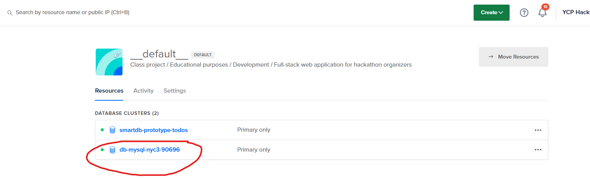
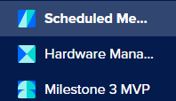

+++
title = 'Digital Ocean'
date = 2024-02-28T00:45:03-05:00
disableToc=true
+++
# Digital Ocean
Digital Ocean is a cloud hosting service provider that we use to host all of the endpoints of 
our website and even the database. Here we will go over the in's and out's of the website.

https://www.digitalocean.com/

After logging into DO, this will be the landing page you will be greeted with. 

## Side Banner
Over on the side of the page is where you navigate to the different "projects" we have hosted

The first tab is the default project DO makes for you, we have our database hosted here

The circled database cluster is the database that website is pulling from. The cluster above that is a test database

The next three "projects" is the website itself split up into 3 parts.

Each are set up the same way so we will look at the Scheduled Message Manager as an example. daKOTA POOP

